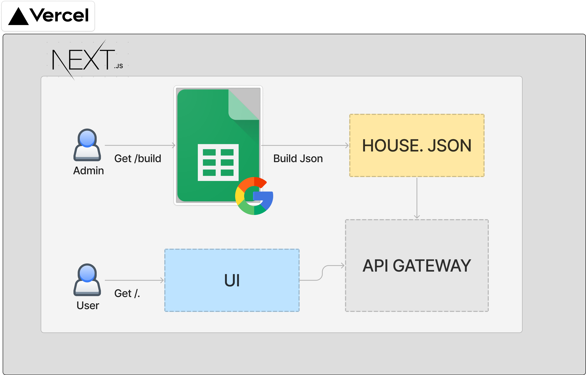

# Public Home

### 적용된 라이브러리/프레임워크/Tool

-   NextJS
-   Styled-Componets
-   Jest
-   Naver-Map v5
-   Redux X 사용목적이 불문명
-   Prettier
-   esLint X 과하다고 생각됨(추후 의논후 결정)

### 폴더구조

```bash
├─components
│  └─NaverMap
├─container
│  └─Home
├─hooks
├─images
├─pages
│  └─api
└─utils
```

-   components : 중복으로 사용되는 컴포넌트
-   container: `관심사`에 따라 한번만 사용되는 컴포넌트
-   pages: route 기능으로 상용됨. container와 1대1 매칭시키는걸 선호! (안될때가 더 많음)
-   hooks: `CustomHook`제작하여 구성
-   images: Static 이미지 파일
-   utils: 도움되는 기능들

### 아키텍쳐


